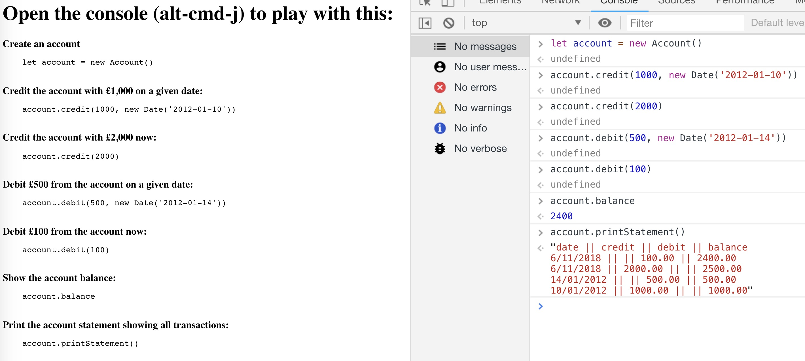

# Bank Tech Test

## Overview

This is my solution to the Makers Bank Tech Test during week 10 of the course.

## Approach

I stuck to the red, green, refactor test cycle pretty well. I wanted to test
drive everything and work in small increments. Hopefully, that is reflected in
my commits, of which there are currently 25.

It took me about 3 hours to setup my environment before I could start testing.
This wasn't ideal, but I was trying to get a comprehensive tool set configured.

I thought about how the code could be structured before writing my first test. I
knew that I would probebly need an Account, Transactions and probably something
for printing statements.

I let the tests dictate what classes and methods I actually needed and tooks
small iterations of between 15 to 30 mins between commits.

## User Interface

The API is designed to be used from a browser console (in the first instance).
As such, I created an `index.html` file that contains instructions on how to do
that. Here's a screenshot:



## Setup

Clone the repository:

`git clone git@github.com:jonurry/bank-tech-test.git`

Change directory:

`cd bank-tech-test`

Install dependencies:

`npm install`

Run tests in watch mode:

`npm t`

Run tests once:

`jest`

Run validation (lint, format, test):

`npm run validate`

Start the web server and play with the bank API in the web browser's console:

`npx serve`

or

`npm run start`

Note: this will start a web server and copy the address to the clipboard. Open
Chrome and paste the URL to get started.

## Interacting with the API

### Create an account

`let account = new Account()`

### Credit the account with £1,000 on a given date

`account.credit(1000, new Date('2012-01-10'))`

### Credit the account with £2,000 now

`account.credit(2000)`

### Debit £500 from the account on a given date

`account.debit(500, new Date('2012-01-14'))`

### Debit £100 from the account now

`account.debit(100)`

### Show the account balance

`account.balance`

### Print the account statement showing all transactions

`account.printStatement()`

## Requirements

- You should be able to interact with your code via a REPL like IRB or the
  JavaScript console. (You don't need to implement a command line interface that
  takes input from STDIN.)
- Deposits, withdrawal.
- Account statement (date, amount, balance) printing.
- Data can be kept in memory (it doesn't need to be stored to a database or
  anything).

## Acceptance criteria

**Given** a client makes a deposit of 1000 on 10-01-2012

**And** a deposit of 2000 on 13-01-2012

**And** a withdrawal of 500 on 14-01-2012

**When** she prints her bank statement

**Then** she would see:

```
date || credit || debit || balance
14/01/2012 || || 500.00 || 2500.00
13/01/2012 || 2000.00 || || 3000.00
10/01/2012 || 1000.00 || || 1000.00
```
